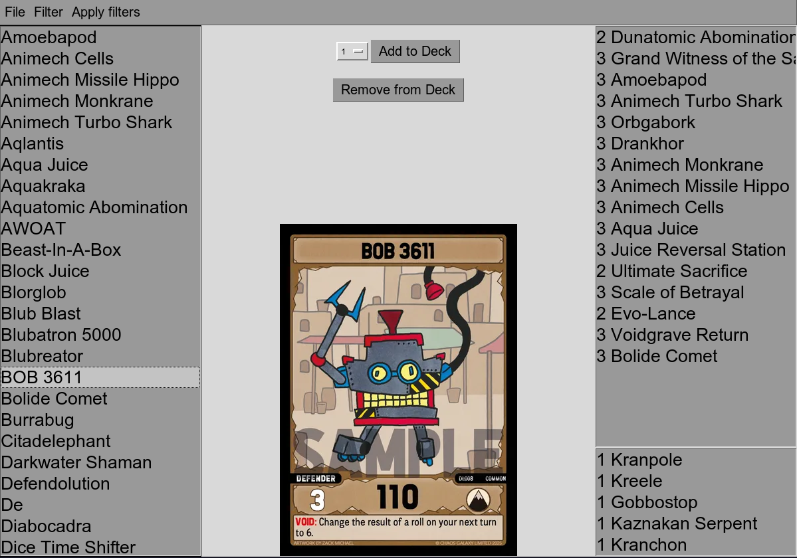

## evo-deck-builder — Build Evolvers TCG decks with ease

**Source Code:** https://github.com/LukiiiSpielt/evo-deck-builder

**Evolvers Discord:** https://discord.gg/45xHaWSG

### Overview: What is evo-deck-builder?
evo-deck-builder is a tool that allows you to easily build decks for the Evolvers TCG using filters and other quality of life features.

#### Features

- build decks within a GUI using filters to find exactly what card you need
- export your deck into the format `untap.in` uses to instantly play using the deck you just made
- export into a json format to continue building your deck later

### Install evo-deck-builder
https://github.com/LukiiiSpielt/evo-deck-builder/releases
